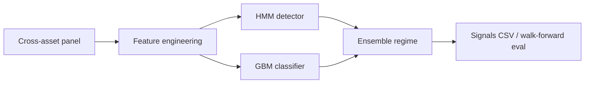

# Macro Regime Classifier

> **Disclaimer:** Experimental research software only. Not investment advice. Past performance does not guarantee future results.

[](https://github.com/aviasthana1/macro-regime-classifier/actions/workflows/ci.yml)

ML toolkit for classifying macro market regimes (**risk-on**, **risk-off**, **reflation**, **slowdown**) from cross-asset momentum, volatility, and spread features.

## Architecture



## Install

```bash
pip install -e '.[dev]'
```

## Quick start

```bash
macro_regime_classifier --walk-forward
python examples/run_regime_pipeline.py
```

## Modules

| Module | Purpose |
| --- | --- |
| `features/` | Rolling momentum, vol z-scores, risk appetite |
| `detectors/` | HMM + gradient boosting classifiers |
| `ensemble/` | Combined regime prediction |
| `evaluation/` | Walk-forward accuracy testing |

## License

MIT
